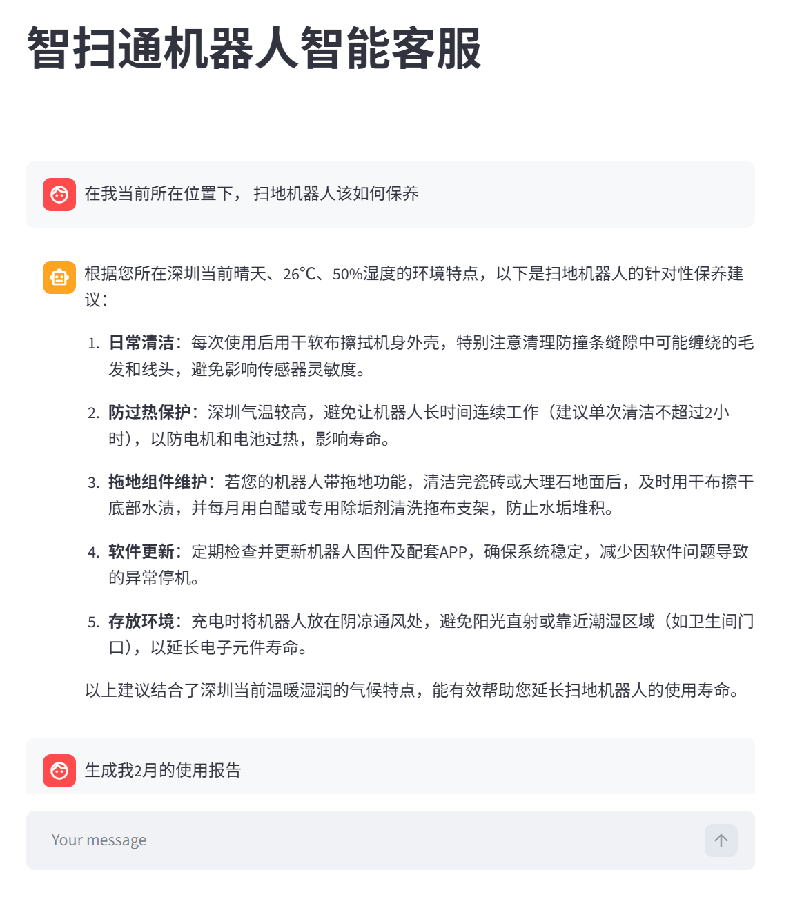
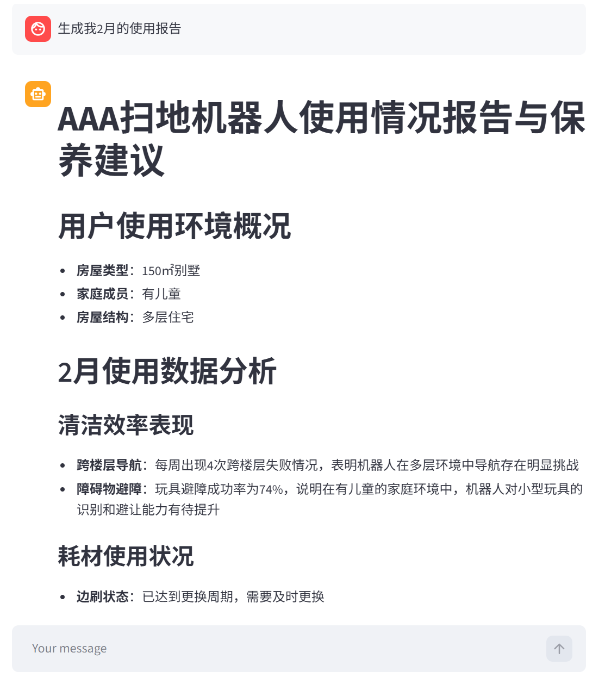
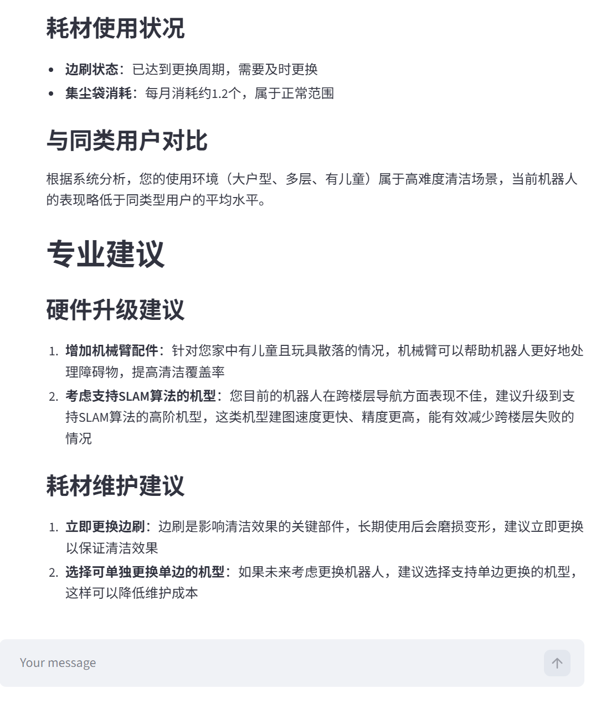
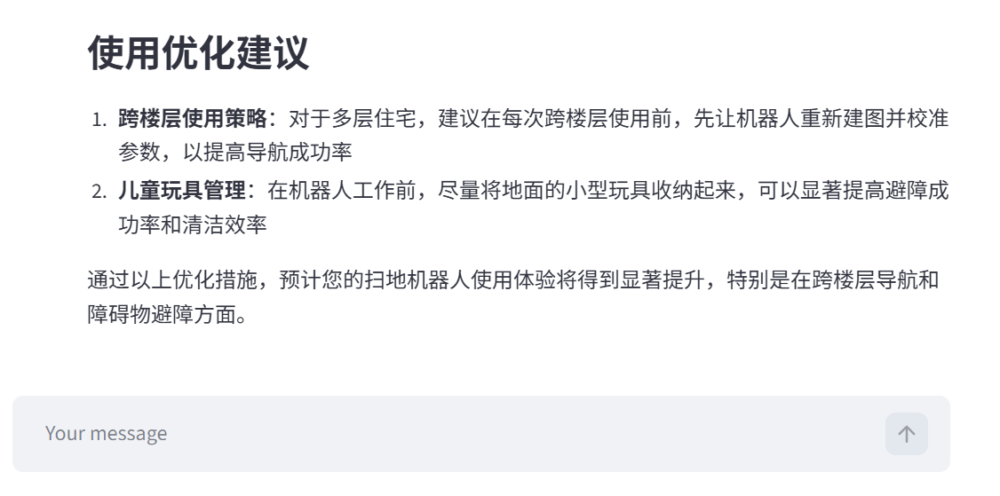

# vacuum-rag-agent
# 基于 RAG的扫地机器人智能客服 Agent
**加载智能客服web网页指令:**python -m streamlit run app.py
## 核心模块
- utils
    - config_handler.py 配置文件处理
    - file_handler.py 文件处理工具
    - logger_handler.py 日志工具
    - path_tool.py 路径工具
    - prompt_loader.py 提示词加载工具
- rag
    - vector_store.py 向量存储服务
    - rag_service.py RAG总结服务
- agent
    - tools
        - agent_tools.py 调用工具
        - middleware.py 中间件
    - react_agent.py Agent创建
- app.py 用户页面
## 成果展示

